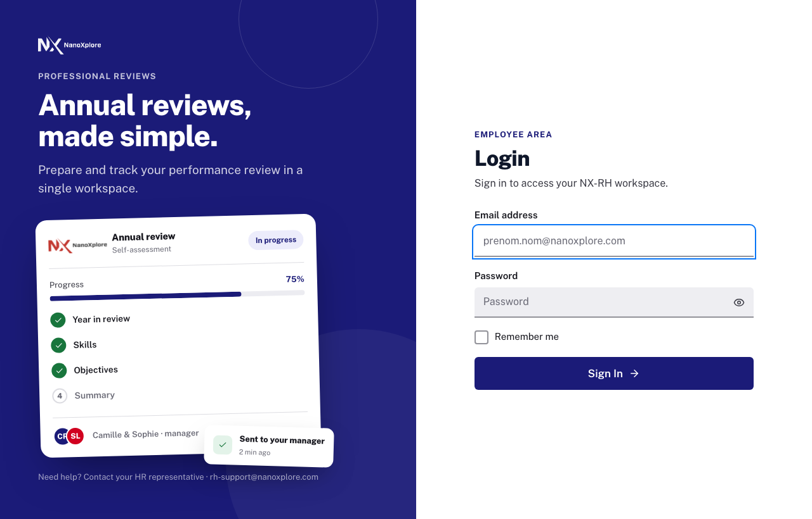

<div align="center">

# NanoXplore RH

**Plateforme RH complète pour les entretiens professionnels, les campagnes d'évaluation et le développement des collaborateurs.**

[](https://github.com/lordrosta-r/NX-RH/actions/workflows/ci.yml)
[](https://github.com/lordrosta-r/NX-RH/actions/workflows/cd.yml)
[](https://github.com/lordrosta-r/NX-RH/actions/workflows/security.yml)
[](https://github.com/lordrosta-r/NX-RH/releases)
[](LICENSE)


<br>



</div>

---

## Présentation

**NanoXplore RH** est une application web qui pilote le cycle annuel d'entretiens et d'évaluations
d'une organisation : de la création des campagnes par la RH jusqu'à la double signature des
entretiens, en passant par l'auto-évaluation des collaborateurs, la revue manager, les objectifs et
les plans de développement individuels (PDI).

L'application est **multilingue** (français / anglais, détection automatique) et **adaptée au rôle**
de chaque utilisateur : employé, manager, RH ou administrateur. Elle remplace les tableurs et les
fils d'e-mails dispersés par un outil unique qui guide chaque acteur tout au long du processus.

---

## Fonctionnalités clés

- **Campagnes d'évaluation** — création, ciblage des participants par rôle/groupe, planification, analyses
- **Constructeur de formulaires** (drag & drop) — auto-évaluation, manager, feedback ascendant, objectifs, demandes
- **Remplissage d'évaluation** avec **contexte N-1** (réponses de l'édition précédente affichées en regard)
- **Vue Entretien** — échange structuré en face-à-face, objectifs, synthèse, double signature, gestion du désaccord
- **Plans de développement individuel (PDI)** et **demandes de mobilité interne**
- **Synchronisation LDAP** multi-annuaires — hiérarchie via l'attribut `manager`, exclusion des comptes de service
- **Gestion des comptes** — blocage / déblocage / suppression RGPD, comptes locaux ou LDAP
- **Espace documentaire** — la RH publie des documents téléchargeables par tous les collaborateurs
- **Organigramme interactif** plein écran
- **Contrôle d'accès par rôle** — employé, manager, RH, admin (+ impersonation en lecture seule)
- **Configuration par l'admin depuis l'UI** — LDAP, SMTP, certificat SSL, logo

---

## Stack technique

| Couche | Technologies |
|---|---|
| Frontend | React 19, TypeScript 6, Vite 8 |
| Routage / état | React Router v6 (`createBrowserRouter`), TanStack Query v5, axios |
| Formulaires / validation | React Hook Form, Zod |
| Style / icônes | Tailwind CSS v3, propriétés CSS personnalisées, lucide-react |
| i18n | react-i18next (fr / en) |
| Backend | Node.js 20, Express 4, MongoDB 7, Mongoose 8 |
| Authentification | JWT en cookies httpOnly (SameSite=Strict), LDAP (ldapjs) |
| Infrastructure | Nginx 1.27 (TLS), Docker multi-stage, Docker Compose |
| Tests | Vitest + Testing Library, Playwright, Jest + Supertest |
| Qualité / sécurité | ESLint, CI/CD (GitHub Actions), Dependabot, CodeQL, npm audit |

Détails et justifications : [docs/STACK.md](docs/STACK.md) et le wiki [Stack-Technique](https://github.com/lordrosta-r/NX-RH/wiki/Stack-Technique).

---

## Démarrage rapide

### Prérequis

- Docker Engine ≥ 24 et Docker Compose v2 (commande `docker compose`)
- Un fichier `.env` à la racine du dépôt — voir [docs/INSTALLATION.md](docs/INSTALLATION.md) et [docs/ENVIRONMENT.md](docs/ENVIRONMENT.md)

> Les certificats TLS ne sont **pas versionnés**. Au premier déploiement, le service `cert-init`
> génère automatiquement un certificat auto-signé `localhost` pour que nginx puisse démarrer. Un
> administrateur téléverse ensuite le vrai certificat depuis l'UI (*Administration → Certificat SSL*).
> Voir [docs/CONFIGURATION.md](docs/CONFIGURATION.md).

### Production

```bash
docker compose --env-file .env -f docker/docker-compose.yml up -d --build
```

Mode haute disponibilité avec plusieurs instances applicatives derrière nginx :

```bash
docker compose --env-file .env -f docker/docker-compose.yml up -d --build --scale app=3
```

> Les fichiers Compose et le `Dockerfile` sont regroupés dans `docker/`. Les commandes
> se lancent depuis la **racine du dépôt** : `--env-file .env` charge le `.env` racine
> pour l'interpolation des variables.

### Développement

```bash
docker compose --env-file .env -f docker/docker-compose.yml -f docker/docker-compose.dev.yml up -d --build
# Frontend : https://localhost (via nginx) ou http://localhost:5173 (Vite)
# API      : https://localhost/api ou http://localhost:3001/api
# MailHog  : http://localhost:8025  ·  phpLDAPadmin : http://localhost:8080
```

---

## Structure du dépôt

```
NX-RH/
├── docker/                       # Conteneurisation regroupée
│   ├── Dockerfile                # Multi-stage : build front Vite → public/ + serveur Express
│   ├── docker-compose.yml        # Stack production : cert-init + nginx + app + mongo
│   └── docker-compose.dev.yml    # Surcharges développement (Vite, MailHog, OpenLDAP)
├── nginx/                        # Reverse proxy + TLS (certs non versionnés)
├── frontend-v2/                  # SPA React / TypeScript / Vite (frontend canonique)
│   └── src/
│       ├── router/index.tsx      # Toutes les routes (source de vérité) — createBrowserRouter
│       ├── components/layout/navConfig.ts  # Navigation par rôle/perspective
│       ├── contexts/             # AuthContext, PerspectiveContext, ConfirmContext
│       ├── layouts/  components/  pages/  features/  api/  hooks/
│       ├── schemas/              # Schémas Zod
│       ├── i18n/locales/         # fr.json, en.json
│       └── styles/tokens.css     # Tokens de design (propriétés CSS)
├── mongo/
│   └── server/                   # Backend Express + Mongoose
│       ├── routes/  models/  services/  middleware/
│       ├── config/constants.js   # Source de vérité des rôles et types métier
│       └── index.js              # Bootstrap + garde-fous de sécurité production
├── docs/                         # Documentation technique détaillée
└── design/                       # Maquettes et tokens de design (référence visuelle)
```

---

## Rôles

Quatre rôles actifs, source de vérité dans [`mongo/server/config/constants.js`](mongo/server/config/constants.js) :

| Rôle | Périmètre |
|---|---|
| **admin** | Contrôle total : configuration serveur, LDAP, SMTP, SSL, audit, état du système, + toutes les capacités RH et manager |
| **hr** | Opérations RH : utilisateurs, campagnes, formulaires, évaluations, signalements RH, départements, paramètres |
| **manager** | Supervision d'équipe : suivi des évaluations, analyses d'équipe, actions à traiter (`/manager/todo`) |
| **employee** | Collaborateur : ses évaluations, son PDI, demandes de mobilité, documents et événements RH |

`ADMIN_ROLES = ['admin', 'hr']`. Le rôle legacy `director` n'existe plus (les comptes concernés sont
traités comme `manager`). Détail de la matrice RBAC : [docs/ROLES_RBAC.md](docs/ROLES_RBAC.md).

---

## Documentation

| Document | Description |
|---|---|
| [docs/INSTALLATION.md](docs/INSTALLATION.md) | Installation initiale pas à pas |
| [docs/CONFIGURATION.md](docs/CONFIGURATION.md) | Configuration admin depuis l'UI (LDAP, SMTP, SSL, logo) |
| [docs/DEPLOYMENT.md](docs/DEPLOYMENT.md) | Guide de déploiement production |
| [docs/UPDATE.md](docs/UPDATE.md) | Procédure de mise à jour et rollback |
| [docs/ARCHITECTURE.md](docs/ARCHITECTURE.md) | Architecture technique |
| [docs/STACK.md](docs/STACK.md) | Choix techniques et justifications |
| [docs/ROLES_RBAC.md](docs/ROLES_RBAC.md) | Rôles et matrice de contrôle d'accès |
| [docs/PAGES.md](docs/PAGES.md) | Inventaire des pages frontend |
| [docs/USER_FLOW.md](docs/USER_FLOW.md) | Parcours utilisateur par rôle |
| [docs/ENVIRONMENT.md](docs/ENVIRONMENT.md) | Référence des variables d'environnement |
| [docs/TROUBLESHOOTING.md](docs/TROUBLESHOOTING.md) | Problèmes courants et résolutions |
| [docs/BACKUP_RESTORE.md](docs/BACKUP_RESTORE.md) | Sauvegarde / restauration |
| [CONTRIBUTING.md](CONTRIBUTING.md) | Conventions de code et de contribution |
| [SECURITY.md](SECURITY.md) | Politique de sécurité et signalement de vulnérabilité |

📖 **Wiki** : un panorama opérationnel et fonctionnel est disponible dans le
[wiki du projet](https://github.com/lordrosta-r/NX-RH/wiki) (installation, architecture, rôles,
déploiement, runbook, FAQ, glossaire).

---

## Licence

NanoXplore RH est un **logiciel propriétaire**. Copyright © 2026 NanoXplore — tous droits réservés.

Toute copie, modification, distribution, ingénierie inverse ou utilisation hors du cadre interne
autorisé par NanoXplore est interdite sans accord écrit préalable. Voir le fichier [LICENSE](LICENSE)
pour les conditions complètes.

Contact : service juridique de NanoXplore (canal interne).
</content>
