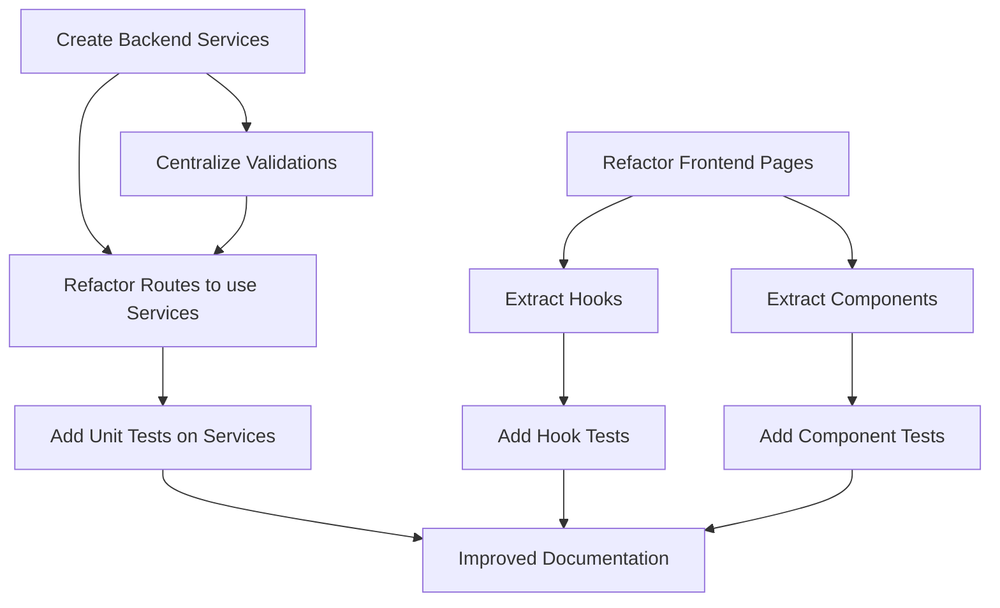

# Audit Architecture & Maintenabilité — NX-RH

**Date:** Mai 2024  
**Scope:** Frontend v2 (React 19, Vite, TailwindCSS, TanStack Query) + Backend (Node.js/Express, MongoDB)  
**Examinateur:** Senior Software Architect

---

## Résumé exécutif

**Score: 6.8/10** ⚠️

Le projet NX-RH présente une **architecture fonctionnelle** avec une bonne séparation frontend/backend et une stack technique moderne. Cependant, il souffre de **plusieurs défis de maintenabilité** critiques :

- ✅ **Bonne séparation frontend/backend** et modularisation de base
- ✅ **Gestion d'état claire** (React Context + TanStack Query)
- ✅ **Middleware d'authentification et d'erreurs robustes**
- ⚠️ **Pages trop volumineuses** (400-600 lignes), logique métier mélangée au rendu
- ⚠️ **Absence de couche Services** côté backend — routes contiennent directement la logique métier
- ⚠️ **Couplage fort** entre routes, modèles et middleware
- ⚠️ **Duplication de code** significative (filtres, validations, permissions)
- ⚠️ **Documentation technique minimale** (JSDoc, README)
- ❌ **Testabilité compromise** — logique pas injectée, pas de services isolables

**Recommandation:** Refactoring prioritaire pour **découpler les couches** et **réduire la complexité des composants**.

---

## P0 — Bloquants

### 1. Architecture Backend : Routes trop épaisses, logique métier centralisée

**Problème:**  
Les fichiers routes (`campaigns.js`: 626 lignes, `users.js`: 551 lignes) contiennent directement :
- Logique de filtre et validation
- Requêtes Mongoose complexes
- Calculs métier (génération d'évaluations, agrégats)
- Notification et audit

**Exemple:** `routes/campaigns.js`
```javascript
// ❌ Pas de service — tout en route
async function generateEvaluationsForCampaign(campaign) {
  // 50 lignes de logique métier
  let userFilter = { isActive: true }
  // ... requêtes complexes, bulk operations ...
}
```

**Impact:**
- Tests impossibles sans lancer le serveur Express
- Réutilisation impossible
- Maintenance difficile (il y a plusieurs générateurs d'évaluations dispersés)
- Débogue compliqué

**Solution P0:**
```javascript
// ✅ À refactoriser
// services/campaignService.js
async function generateEvaluationsForCampaign(campaign) { }
async function transitionCampaignStatus(campaignId, newStatus) { }
async function cloneCampaign(campaignId, newName) { }
```

---

### 2. Backend : Absence de couche Service — duplication et couplage

**Problème:**
- Pas de `services/` cohérent (seulement du notification, LDAP, mailer)
- La logique applicative vit dans les routes
- Même logique réimplémentée dans plusieurs routes (`evaluations/mutations.js`, `evaluations/bulk.js`, `evaluations/queries.js`)

**Exemples de duplication:**
- **Validation permissions:** Chaque route réimplémente `if (!ADMIN_ROLES.includes(...)) return 403`
- **Filtrage utilisateurs par rôle:** Répété dans `users.js`, `evaluations.js`, `analytics.js`
- **Agrégation évaluations:** Présente en `analytics.js`, `evaluations/queries.js`, et `campaigns.js`

**Impact:**
- Bug fixes nécessitent chercher 3+ endroits
- Incohérence de comportement
- Difficile à maintenir lors d'ajout de rôles

**Solution P0:**
Créer `services/`:
```
services/
├── campaignService.js       # Logique métier campagnes
├── evaluationService.js      # Logique métier évaluations
├── userService.js            # Logique métier utilisateurs
├── analyticsService.js       # Agrégats & rapports
├── permissionService.js      # Centralize all role/permission checks
└── notificationService.js    # Déjà existe, à enrichir
```

---

### 3. Frontend : Pages trop volumineuses, logique métier mélangée

**Problème:**
Pages 400-600 lignes avec:
- Rendu direct
- Logique de filtrage/pagination
- Appels API
- Gestion d'état locale complexe

**Exemples:**
- `UsersPage.tsx` (577 lignes): Pagination, filtres, actions, rendu
- `OrgPage.tsx` (523 lignes): Org tree, React Flow, multiple views
- `OffboardingPage.tsx` (487 lignes): Filtering, fetching, rendering ensemble

**Code Smell:**
```tsx
// ❌ UsersPage.tsx — trop de responsabilités
function UsersPage() {
  const [filters, setFilters] = useState(...)  // État locale
  const [page, setPage] = useState(1)          // Pagination
  const { data, isLoading } = useQuery(...)    // Data
  
  // 200 lignes de JSX rendu + actions
  return <div className="...">
    {/* Table, filters, actions */}
  </div>
}
```

**Impact:**
- Impossible à tester
- Réutilisation impossible
- Hard à débuguer interactions
- Onboarding difficile pour nouveaux devs

**Solution P0:**
```tsx
// ✅ À refactoriser
// components/users/UserTable.tsx — rendu uniquement
// components/users/UserFilters.tsx — filtres
// components/users/UserActions.tsx — actions
// hooks/useUsersList.ts — logique liste (state + data)
```

---

### 4. Backend : Testabilité compromise — pas d'injection de dépendances

**Problème:**
```javascript
// routes/users.js — impossible à tester isolé
const { User, Evaluation, AuditLog } = require('../models')

router.get('/:id', async (req, res, next) => {
  // Pas moyen de mocker User, Evaluation, etc.
  const user = await User.findById(...)  // ❌ Accès direct à la DB
})
```

**Impact:**
- Tests d'intégration uniquement (lent, fragile)
- Mock impossible
- Pas de tests unitaires réalistes

**Solution P0:**
```javascript
// ✅ À implémenter
function createUserController(userModel, evaluationModel, auditLog) {
  return {
    getUser: async (req, res) => {
      const user = await userModel.findById(...)
    }
  }
}
```

---

## P1 — Importants

### 1. Gestion des Erreurs & Validations : Inconsistent & incomplete

**Problème:**
- Validateurs existent (`validators/`) mais pas systématiquement utilisés
- Validation mélangée dans les routes
- Pas de validation globale des inputs côté API

**Exemple manquant:**
```javascript
// ❌ userValidators.js existe mais utilisé irrégulièrement
// campaigns.js n'a pas de validateurs propres
router.post('/', async (req, res) => {
  // Pas d'appel validateCampaignCreate()
  const { name, startDate, endDate } = req.body
  // Validation inline ad-hoc
  if (!name || typeof name !== 'string') { /* ... */ }
})
```

**À faire:**
- Appliquer validateurs de façon **systématique** dans toutes les routes
- Créer validateurs manquants (campaigns, evaluations, forms)
- Middleware de validation global

---

### 2. Frontend : État global fragmenté — context + local state + TanStack Query

**Problème:**
Trois sources de vérité:
- `AuthContext` (user, auth)
- `queryClient` (data distante)
- State local (filters, modals, pagination)

Pas de pattern clair pour savoir où mettre l'état.

**Exemple:**
```tsx
// ❌ Où dois-je garder l'état des filtres ?
const [filters, setFilters] = useState(...)        // Local ?
const { data } = useQuery(..., { filters })      // TanStack ?
const { user } = useAuth()                         // Context ?
```

**À faire:**
- Documenter pattern d'état (1 source de vérité par concept)
- Considérer Redux/Zustand pour l'état applicatif complexe
- Ou enrichir TanStack Query avec mutations pour les filtres

---

### 3. Sécurité : CORS, CSP, validations inputs

**Problème Positif:** `index.js` a helmet(), CORS strict, rate limiters ✅

**Problème Négatif:**
- Validation regex côté backend risque ReDoS (`routes/users.js:46`)
- Pas de validation XSS côté frontend systématique
- Pas de CSRF protection explicite
- Sanitization Mongo ad-hoc (`routes/users.js`) + `express-mongo-sanitize` (redondant)

**Correction:**
- Utiliser `express-validator` plutôt que validations manuelles
- Ajouter CSRF middleware
- Centraliser sanitization

---

### 4. Performance : N+1 Queries & missing indexes

**Problème:**
```javascript
// ❌ N+1 queries — pas de population groupée
const campaigns = await Campaign.find(filter).lean()
for (const campaign of campaigns) {
  campaign.forms = await Form.find({ _id: { $in: campaign.formIds } })
  // N requêtes supplémentaires !
}
```

**À faire:**
- Audit des `.populate()` manquants
- Ajouter indexes manquants (sectorId, managerId, etc.)
- Implémenter data loader / batch queries

---

### 5. Documentation: Minimale, JSDoc absent

**Problème:**
- Pas de README architecture
- Routes sans JSDoc
- Types TypeScript frontend mais pas commentés
- Services sans documentation métier

**Exemple:**
```javascript
// ❌ Aucun commentaire sur la logique
async function generateEvaluationsForCampaign(campaign) {
  // Quand est appelée ? Quelles side-effects ? Quels cas limites ?
}
```

**À faire:**
- JSDoc sur chaque endpoint et service
- README `docs/ARCHITECTURE.md`
- Commentaires sur logique complexe (notifications, evaluations flow)

---

## P2 — Mineurs

### 1. Frontend : Type Safety Gaps

**Problème:**
- Types TypeScript complets (`types/index.ts`) ✅
- Mais usage `as any` ou `any` implicite çà et là

**À faire:**
- Lint strict TypeScript
- Éviter `as any`

---

### 2. Backend : CommonJS vs ESM mixing

**Problème:**
Tout le backend est CommonJS (`require/module.exports`) — correct, mais:
- Inconsistent avec convention moderne (ESM)
- Difficile à porter
- Limite interop avec packages ESM

**À faire (optionnel):**
- Upgrade vers ESM si nouveau feature lourd (peu urgent)
- Pour l'instant: rester CommonJS, mais clarifier dans docs

---

### 3. Component Nesting : Shallow vs Deep

**Problème:**
`/components/` structure plate avec peu de sous-dossiers:
```
components/
├── layout/          ✅
├── org/            ✅
├── shared/         ✅
├── ui/             ✅
└── (many loose components)  ❌
```

Difficult pour 150+ fichiers frontend.

**À faire:**
- Grouper par feature: `components/users/`, `components/evaluations/`, etc.
- Isoler UI composables de domain logic

---

### 4. Locales/i18n : Non-existent

**Problème:**
- Types mention `locale: 'fr' | 'en'` mais pas d'implémentation
- Hard-coded français dans toutes les pages

**À faire:**
- Ajouter `i18n` library (react-i18next)
- Externaliser chaînes

---

### 5. Error Boundaries: Missing

**Problème:**
Frontend sans Error Boundary — un crash en JS = page blanche.

**À faire:**
- Implémenter React Error Boundary globale
- Fallback UI gracieux

---

## Points positifs ✅

### 1. **Authentification & Autorisation bien structurées**
- `authGuard` middleware robuste
- Rôles whitelist (pas d'elevation accidents)
- JWT + httpOnly cookies ✅
- Revérification actif en DB à chaque requête ✅

### 2. **API REST bien structurée**
- Endpoints cohérents (`/api/users`, `/api/campaigns`, etc.)
- Versioning possible (prêt pour `/api/v2`)
- Rate limiting ✅
- SPA fallback propre

### 3. **Types TypeScript complets & métier bien modélisés**
- `types/index.ts` exhaustive
- Relations complexes (Evaluation, Campaign, Form) représentées
- Enums pour rôles, statuts

### 4. **Middleware d'erreurs centralisé & propre**
- `errorHandler.js` gère tous les cas (Mongoose, JWT, custom)
- Masque détails 500 en production
- Normalise réponses API

### 5. **React Query bien utilisé**
- QueryClient config appropriée
- Devtools présent ✅
- `keepPreviousData` pour pagination
- Retry intelligents

### 6. **Sécurité par défaut**
- Helmet, CORS strict, CSP
- Password hashing bcrypt
- Sanitization Mongo
- Pas de secrets en code

### 7. **Modularité de base**
- Routes isolées par domaine
- Models Mongoose séparés
- Contexts React découpés
- API client modulaire

---

## Recommandations prioritaires

### Phase 1 (2-3 sprints) — Fondations

#### 1a. **Créer couche Service backend**
```
Effort: 3-4 jours
Impact: Énorme (testabilité, maintenance)

Actions:
- Extraire logique de campaigns.js → campaignService.js
- Extraire logique de evaluations/ → evaluationService.js
- Centraliser permissionService.js
- Créer analyticsService.js
- Routes = HTTP layer uniquement (req/res)
- Services = business logic uniquement
```

**Avant:**
```javascript
router.post('/', async (req, res) => {
  // 50 lignes de logique
})
```

**Après:**
```javascript
router.post('/', async (req, res, next) => {
  const campaign = await campaignService.create(req.body)
  res.status(201).json(campaign)
})
```

#### 1b. **Refactor gros pages frontend**
```
Effort: 1-2 jours par page
Impact: Maintenabilité, réutilisabilité

Pages cibles:
- UsersPage → UserTable + UserFilters + useUsersList hook
- OrgPage → OrgTeamsView + OrgSectorsView + composants réutilisables
- OffboardingPage → OffboardingTable + OffboardingFilters
- CampaignsPage (si >300 lignes)
```

**Pattern:**
```tsx
// ✅ Découper en:
// 1. Hook pour logique
export function useUsersList(initialFilters) {
  const [page, setPage] = useState(1)
  const { data, isLoading } = useQuery(...)
  return { data, isLoading, page, setPage, ... }
}

// 2. Composant filtres
export function UserFilters({ value, onChange }) {
  return <div>...</div>
}

// 3. Composant table
export function UserTable({ data, onAction }) {
  return <table>...</table>
}

// 4. Page = orchestration
export default function UsersPage() {
  const list = useUsersList()
  return <>
    <UserFilters value={list.filters} onChange={...} />
    <UserTable data={list.data} />
  </>
}
```

### Phase 2 (1 sprint) — Documentation & Tooling

#### 2a. **Architecture Documentation**
```
Créer docs/ARCHITECTURE.md
- Vue d'ensemble stack
- Conventions (naming, file structure)
- Patterns (auth, state, data fetching)
- Decisions (pourquoi CommonJS, pourquoi pas Redux, etc.)
```

#### 2b. **JSDoc sur couches critiques**
```
Routes principales, Services, Models
- Quoi fait la fonction
- Params requis
- Return type
- Side-effects (email, notifications)
- Cas limites, erreurs attendues
```

#### 2c. **Setup Tests**
```
Backend: Jest + supertest
- Unit tests sur services
- Integration tests sur routes
- Coverage target: >60%

Frontend: Vitest + React Testing Library
- Hooks tests (useUsersList, useAuth)
- Component tests (UserTable, Filters)
```

### Phase 3 (2 sprints) — Qualité

#### 3a. **Validation centralisée**
```
- Utiliser express-validator systématiquement
- Créer custom validators (isCampaignActive, etc.)
- Middleware validation global
```

#### 3b. **Error Boundaries frontend**
```
React Error Boundary globale + par page
Graceful fallback UI
```

#### 3c. **Performance audit**
```
- Query analyzer MongoDB (detect N+1)
- Frontend bundle size (Vite stats)
- Lighthouse scores
```

---

## Dépendances de refactoring



---

## Checklist Onboarding nouveau développeur

- [ ] Clone repo, install deps (`npm install` + `docker-compose up`)
- [ ] Read `docs/ARCHITECTURE.md` (à créer)
- [ ] Read `README.md` + `SECURITY_AUDIT.md` (existants)
- [ ] Faire un POST simple frontend (login) pour comprendre flow
- [ ] Faire un GET backend simple (`/api/users/me`) pour comprendre routes
- [ ] Run tests (`npm test` backend + frontend)
- [ ] Setup ESLint + prettier en editor
- [ ] Demander code review sur première PR avant merge

---

## Score détaillé par catégorie

| Critère | Score | Notes |
|---------|-------|-------|
| **Séparation responsabilités** | 5/10 | Routes trop épaisses, pas de services |
| **Couplage** | 6/10 | Bon frontend, backend manque abstraction |
| **DRY** | 4/10 | Duplication validation, filters, permissions |
| **Complexité composants** | 5/10 | Pages 400-600 lignes, logique mélangée |
| **Nommage** | 8/10 | Cohérent, clair (camelCase, kebab-case) |
| **Structure dossiers** | 7/10 | Logique mais pages frontend plates |
| **Gestion d'état** | 7/10 | Context + TanStack Query, pas clair où mettre quoi |
| **Testabilité** | 4/10 | Pas d'injection, logique dans routes |
| **Documentation** | 3/10 | Minimale, pas JSDoc, pas architecture docs |
| **DX (Onboarding)** | 5/10 | Pas de guide, structure à découvrir |
| | | |
| **TOTAL** | **6.8/10** | À améliorer avant scaling |

---

## Timeline estimé pour améliorations P0

| Tâche | Effort | Sprint | Bénéfice |
|-------|--------|--------|----------|
| Backend Services | 4j | S1 | Testabilité, maintenance |
| Frontend Page Refactor | 5j | S1-S2 | Réutilisabilité, maintenabilité |
| Documentation | 2j | S2 | Onboarding, clarity |
| Testing setup | 3j | S2 | Régression prevention |
| **TOTAL** | **14j** | **2-3 sprints** | **Foundation stable** |

---

## Conclusion

Le projet NX-RH a une **bonne base**, mais souffre d'une **concentration de logique** dans les routes et pages, rendant **refactoring et test difficiles**. 

Les améliorations recommandées sont **progressives et non-breaking** :
- Extraction de services backend (impact zéro sur routes)
- Refactor pages frontend en composants (réutilisables)
- Ajout documentation & tests (qualité)

Une fois ces phases complétées, la **maintenabilité améliorera significativement** et la **scalabilité sera possible**.

**Next Step:** Valider les P0 avec le tech lead et planifier Phase 1 (Services) pour le prochain sprint.
